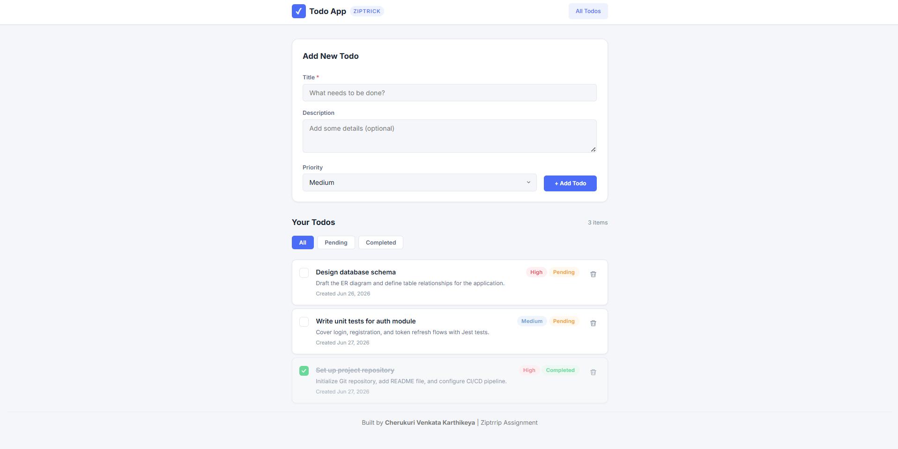
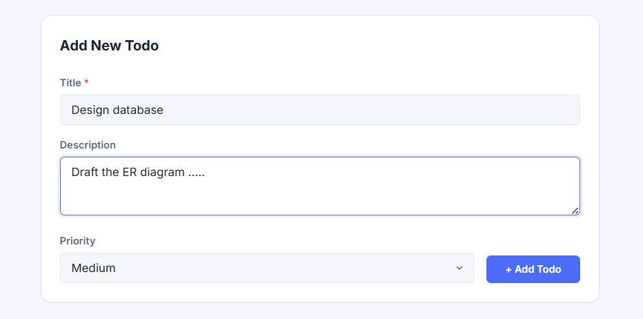
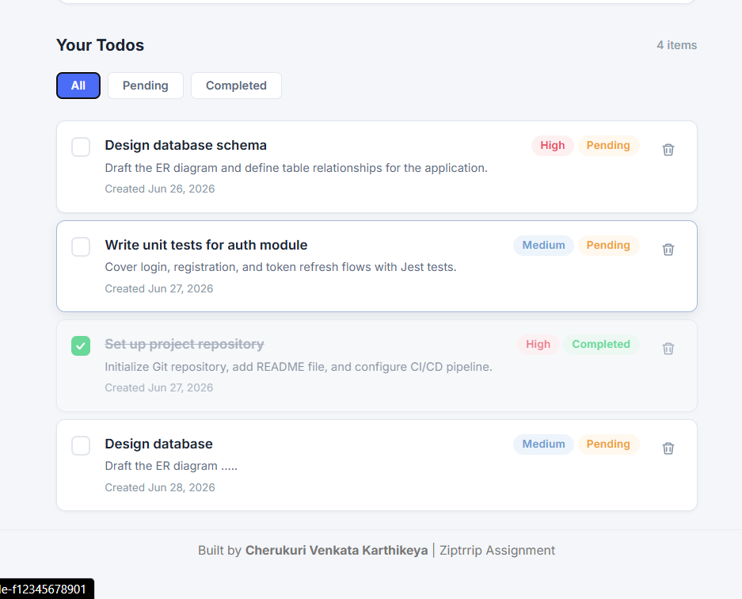
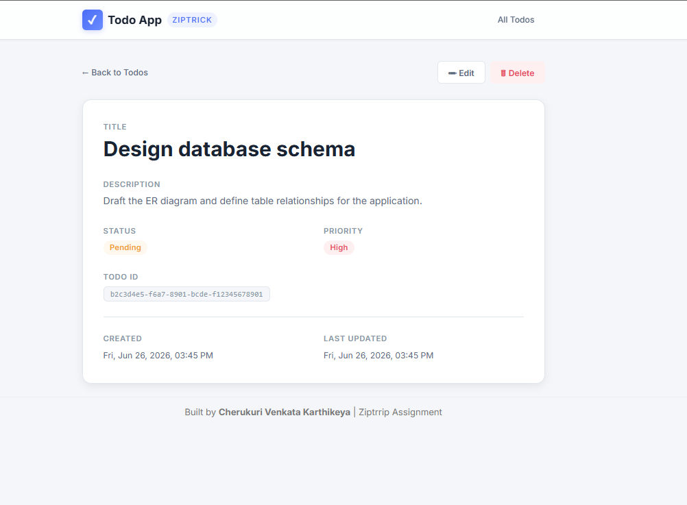
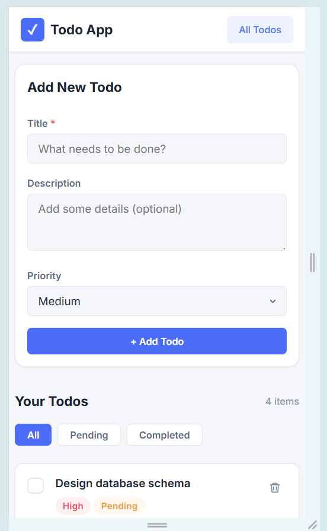

# 📝 Ziptrrip Todo Application (Full-Stack MERN-Style Project)

A full-stack **Todo Management Application** built using **React (Frontend)** and **Node.js / Express (Backend)** as part of the Ziptrick developer assignment.

This project demonstrates a **production-style full-stack architecture** with REST APIs, multi-page routing, modular backend structure, and clean UI/UX design.

---
## 🌐 Live Deployment

- 🔗 **Frontend (Vercel):** https://todo-app-ziptrrip.vercel.app  
- 🔗 **Backend (Render):** https://todo-app-ziptrrip.onrender.com  
- 🔗 **API Endpoint:** https://todo-app-ziptrrip.onrender.com/api/todos  

---

## 🚀 Project Overview

The Ziptrick Todo Application is a task management system that enables users to efficiently create, update, delete, and manage tasks.

It follows a **client-server architecture**:

- **Frontend:** React-based UI with multi-page routing
- **Backend:** Node.js + Express REST API
- **Storage:** JSON file-based persistence (development-ready architecture)

---

## ✨ Key Features

### 🧩 Task Management
- Create todos with title, description, and priority (Low / Medium / High)
- View all todos in a structured, organized list
- Update todos using inline editing on the detail page
- Delete todos with confirmation dialog
- Toggle status between **Pending ↔ Completed**

### 📊 User Interface & Experience
- Clean and responsive UI across all devices
- Priority indicators (Low / Medium / High)
- Status badges for task tracking
- Loading states for API interactions
- Error handling with user-friendly messages
- Empty state handling for better UX

### 🧭 Multi-Page Navigation
Built using **React Router (Multi-Page Architecture)**:

- **Todo List Page (`/`)**
  - View all todos
  - Add new todos
  - Filter by status (All / Pending / Completed)

- **Todo Detail Page (`/todo/:id`)**
  - View complete todo details
  - Inline edit and update fields
  - Delete todo with confirmation
  - Navigate back to list

---

## 🛠 Tech Stack

| Layer      | Technology                          |
|------------|-------------------------------------|
| Frontend   | React 18, React Router v6, Axios    |
| Backend    | Node.js, Express.js, UUID           |
| Storage    | JSON File-Based Persistence         |
| Tooling    | Create React App, Concurrently      |

---


## 🖼 Application Screenshots

### 🏠 Home Page (Todo List)


### ➕ Add Todo Feature


### ✏️ Edit Todo Page


### 📄 Todo Detail Page  


### 📱 Responsive Mobile View

---

## 📋 Prerequisites

- Node.js (v16+ recommended)
- npm (v8+ included with Node.js)

---

## 🚀 Getting Started

### 1️⃣ Clone Repository
```bash
git clone <repository-url>
cd todo-app

2️⃣ Install Dependencies
npm run install:all

Or install manually:

# Backend
cd server && npm install

# Frontend
cd client && npm install

3️⃣ Run Application
npm run dev

Or run separately:

# Backend
npm run start:server

# Frontend
npm run start:client

4️⃣ Access Application
Frontend → http://localhost:3000
Backend → http://localhost:5000/api/todos

📡 API Endpoints

| Method | Endpoint       | Description       |
| ------ | -------------- | ----------------- |
| GET    | /api/todos     | Fetch all todos   |
| GET    | /api/todos/:id | Fetch single todo |
| POST   | /api/todos     | Create new todo   |
| PUT    | /api/todos/:id | Update todo       |
| DELETE | /api/todos/:id | Delete todo       |

🧾 Data Model

{
  "id": "uuid-string",
  "title": "string",
  "description": "string",
  "status": "pending | completed",
  "priority": "low | medium | high",
  "createdAt": "ISO timestamp",
  "updatedAt": "ISO timestamp"
}

📁 Project Structure

todo-app/
├── server/
│   ├── data/
│   ├── src/
│   │   ├── routes/
│   │   ├── controllers/
│   │   ├── models/
│   │   └── middleware/
│
└── client/
    ├── public/
    ├── src/
        ├── components/
        ├── pages/
        ├── services/
        └── styles/

📄 Application Pages

🏠 Todo List Page (/)
Display all todos
Add new todos
Filter by status
Toggle completion status
Navigate to detail page

📄 Todo Detail Page (/todo/:id)

Fetch todo using URL parameter
View full details
Edit fields inline
Save updates
Delete todo
Navigate back

📌 Assumptions

File-Based Storage: Todos are stored in a JSON file for development/demo purposes. In production, this should be replaced with a database like MongoDB or PostgreSQL.
No Authentication: The system does not implement authentication or authorization.
Single User System: Designed for single-user usage only.
Default Priority: If not specified, priority defaults to medium.
Default Status: New todos are created with pending status.
API Proxy: Development server proxies API requests to http://localhost:5000.

📝 License

This project was developed as part of the Ziptrick Developer Assignment Evaluation.
